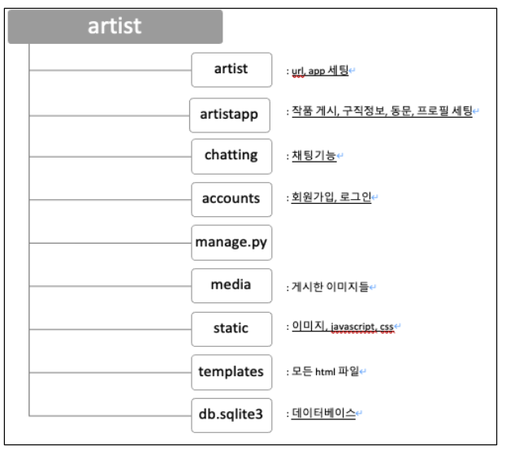
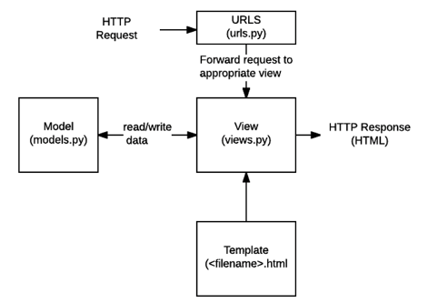
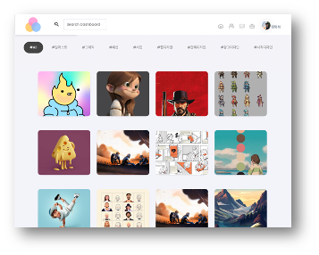
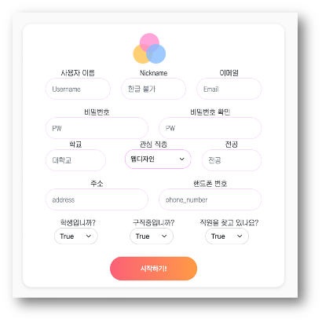
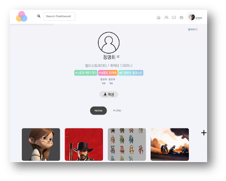
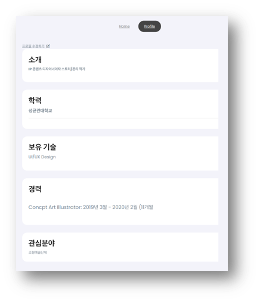
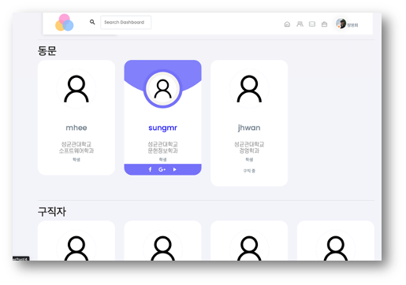

# Hackerton-LikeLion

(1. 2. 는 ~/Hackerton-LikeLion 에서)
1. git clone  
 ```git clone https://github.com/jmhee28/Hackerton-LikeLion.git```

2. 가상환경 키기  
 ```source myvenv/Scripts/activate```

3. 장고 키기  

 ```cd GUAKKIRI```  

 ```python manage.py runserver```
 
# Fortist

- 한 줄 소개: 예술인들을 위한 구인구직 플랫폼  

- 사용기술: Django, Python  

- 진행기간: 2023년 8월 19일 → 2023년 8월 20일  

- 팀구성: 백엔드 2명 프론트 3명  


## **개발 목적**

멋쟁이 사자처럼 10기 2022 해커톤 팀프로젝트

## **개요**

기존의 예술인들이 구직활동을 할 때 자신의 작업물들을 이력서를 제출할 때마다 분류하고 찾을 필요 없이 효율적으로 포트폴리오를 관리할 수 있다. 기업의 헤드헌터들에게는 직무와 연관된 작업물들을 만든 구직자를 쉽게 찾을 수 있게 될 것이다.

---

## 시스템 구성 & **구현방법**
<div style="text-align: center">
    
    
</div>


## 결과


> **메인 페이지**
> 

<div style="display: flex; align-items: center;">
    
    
</div>

 상단에 ‘#All’, ‘#일러스트’, ... , ‘#시각디자인’ 을 클릭하면 각각 카테고리별 작품을 보여준다.
아래 사진은 메인페이지에서 그림에 마우스를 올려두었을 때 나타나는 모습이다. 좋아요 수, 그림의 제목, 작가이름을 표시한다.

---

> **회원가입**
> 

 

관심직종의 경우 웹디자인, 일러스트, 그래픽, 패션, 사진, CG, 시각디자인, 건축디자인, 광고디자인 중 선택하도록 하였다.

---

> **유저 페이지**
> 

마이페이지에서는 본인이 상태(학생, 구직 중, 헤드헌터) 등을 보여준다. Home 버튼은 자신의 작업물을 보여주고, Profile 버튼은 오른쪽과 같이 본인의 소개, 학력, 보유기술, 경력, 관심분야를 보여준다.
<div style="display: flex; align-items: center;">
    
    
</div>

---

> **동문, 구직자, 헤드헌터 표시 페이지**
> 



동문, 구직자, 헤드헌터로 나누어서 나타내는데, 동문은 현재 로그인 된 사용자와 같은 학교 회원들을 나타낸다. 각각의 카드에는 해당 사용자의 닉네임, 학교, 학교, 상태 등이 표시된다. 닉네임을 클릭하면 해당 사용자의 페이지로 이동한다.

